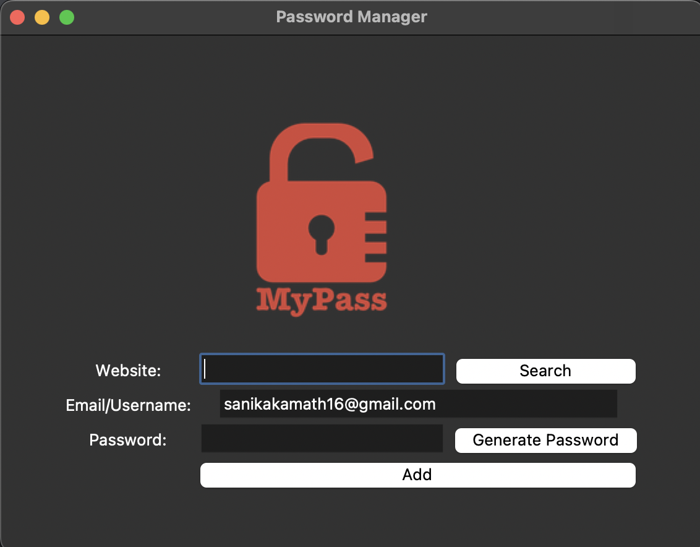

# Password Manager 🔒

This is a simple Password Manager built with Python's Tkinter library. The application allows you to generate strong, random passwords, store them securely, and retrieve them when needed. The data is saved locally in a JSON file for easy access and modification.

## Features

- **Password Generation**: Generate secure, random passwords with a mix of letters, numbers, and symbols.
- **Save Credentials**: Store website names, emails, and passwords securely in a JSON file.
- **Retrieve Credentials**: Search for saved credentials by website name and retrieve email and password information.
- **Data Persistence**: All data is saved in a `data.json` file, which allows the app to persist between sessions.

## Installation

To use this application, you'll need Python installed on your computer. This project also requires the `pyperclip` library for clipboard functionality.

1. Clone the repository:
   ```bash
   git clone https://github.com/your-username/password-manager.git
   ```
   
2. Navigate to the project directory:
   ```bash
   cd password-manager
   ```
   
3. Install dependencies:
   ```bash
   pip install pyperclip
   ```
   
4. Run the application:
   ```bash
   python main.py
   ```

## How to Use

1. **Add a New Password**:
   - Enter the website name, email/username, and password.
   - You can click **Generate Password** to create a random, secure password. The generated password is automatically copied to your clipboard for convenience.
   - Click **Add** to save the credentials to the `data.json` file.
   
2. **Find a Password**:
   - Enter the website name and click **Search**.
   - If the website exists in `data.json`, the email and password details will be displayed in a popup.
   - If the website is not found, you'll see an error message.

3. **Password File Management**:
   - All saved data is stored in `data.json`. If this file doesn't exist, it will be created automatically.
   - The JSON format ensures easy readability and quick data retrieval.

## File Structure

- **main.py**: The main file that runs the Password Manager application.
- **logo.png**: The logo image displayed in the application UI.
- **data.json**: The JSON file where credentials are saved.

## Code Overview

- **generate_password**: Generates a random password using letters, numbers, and symbols.
- **save**: Saves the website, email, and password data into `data.json`. If the file doesn’t exist, it creates a new one.
- **find_password**: Searches for a website's credentials in `data.json` and displays them if found.
- **UI Setup**: Configures the Tkinter interface, with labels, buttons, and entry fields for input.

## Example UI



## License

This project is open-source and available under the [MIT License](LICENSE).
